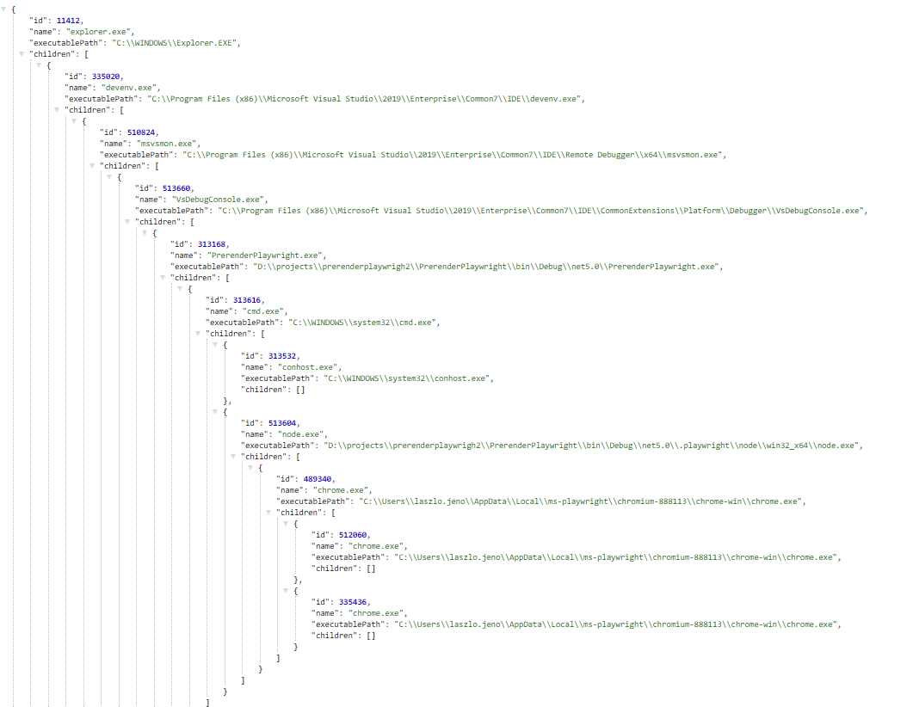

# PrerenderPlaywright

This is a demo of Prerendering using [Playwright](https://playwright.dev/). 

The main differences are between the Selenium demo and this is that the processes are all children of the main app and will shut down without leaving orphants. 

The api is also more modern: allows http interception without hacky solutions and it is also fully async. 

http://localhost:5000/processes

